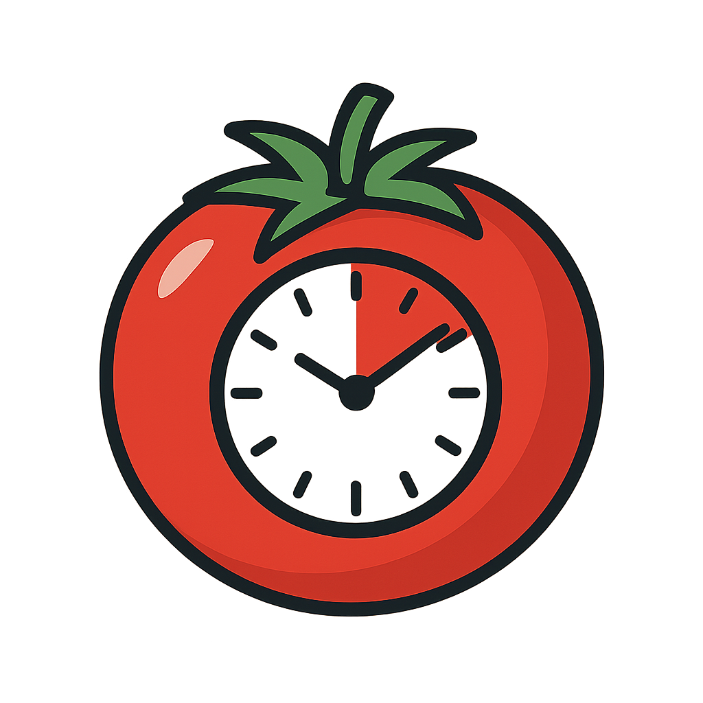

# Pomodoro⏳



A CLI-based Pomodoro timer and session tracker written in Go.  
Track your focus sessions, breaks, and review your productivity history with persistent storage and logs.

---

## Features

- Start Pomodoro sessions with custom durations, break times, and reminders
- Track session history and view statistics
- Reset (delete) session records by name or all at once
- Persistent storage using SQLite (configurable database)
- Colorful CLI output and desktop notifications
- Detailed logging to files in the `logs/` directory

---

## Installation

1. **Clone the repository:**
   ```sh
   git clone https://github.com/azema-shaik/pomo.git
   cd pomo

1. **Install dependencies:**
    ```sh    
    go mod tidy
    ```
1. **Build the application**:
    ```sh
    go build -o pomo
    ```
## Usage
```sh
./pomo [COMMAND] [OPTIONS]
```


## Main Commands
`start` — Start a new Pomodoro session
`status` — View session history
`reset` — Delete session records
`help` — Show help

## Start a Session
```sh
./pomo start --name "Deep Work" --duration 50 --unit minute --break 10 --reminder 5
```

- -name (required): Name of the session
- -duration (default: 25): Duration of the session
- -unit (default: minute): "minute" or "hour"
- -break (default: 5): Break time in minutes
- -reminder (default: 2): Reminder before session end (minutes)

## View Status
```sh
./pomo status --name all
```

## Reset Sessions
 ```sh
 ./pomo reset --name all
 ```

## Help
 ```sh
 ./pomo help
./pomo start --help
```

## Configuration 
- The app uses .config/session.json for configuration.
- Example:
    ```json
    {
        "db": "test.db"
    }
    ```
- By default, the database is pomo.db in the project directory.
- You can specify a different database in the config.

## Logs
- Logs are stored in the logs/ directory, with one file per day.
- Each module (CLI, commands, data, utils) has its own logger.

## Dependencies
- modernc.org/sqlite — SQLite driver
- github.com/gen2brain/beeep — Desktop notifications
- github.com/azema-shaik/logger — Custom logging
